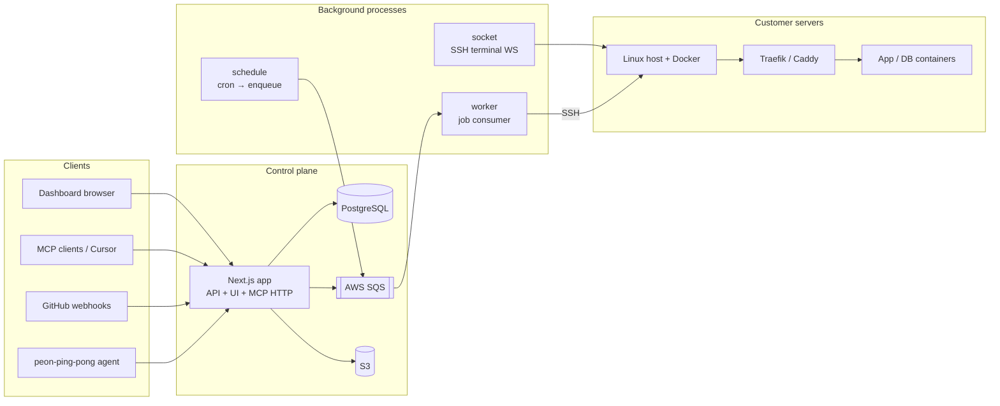
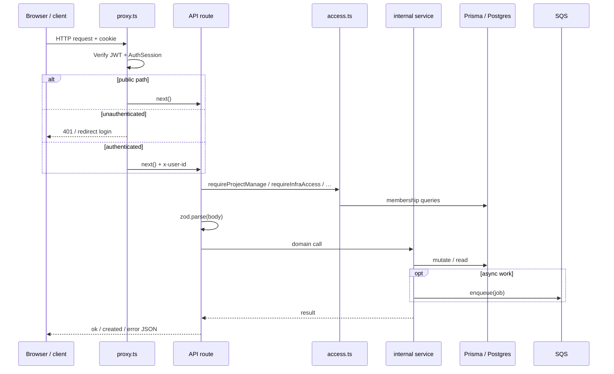
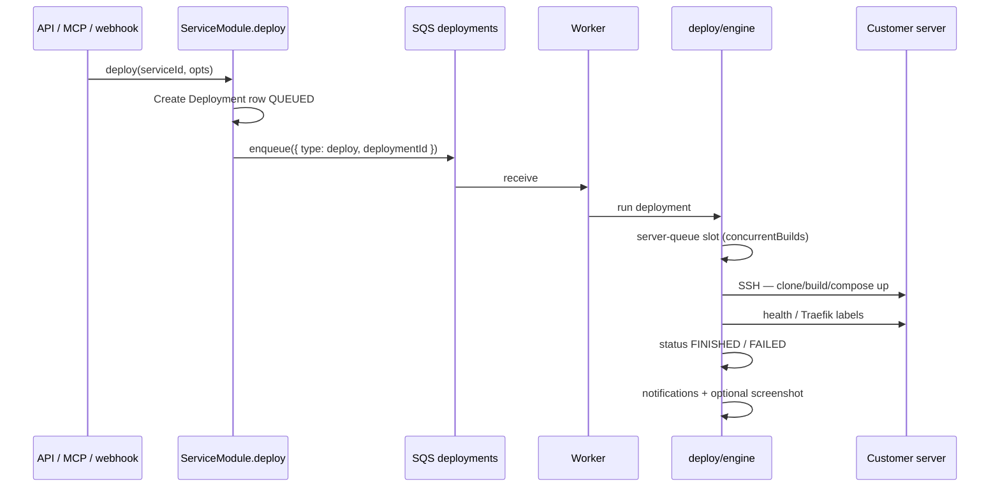

# Peon Architecture

This document describes how the Peon application is structured: control plane, workers, data model, authz, deploy pipeline, MCP/chat, and frontend. It is the primary reference for contributors and operators.

Related docs:

- [PERMISSIONS.md](./PERMISSIONS.md) — workspace/project RBAC matrix (if present)
- [user-manual.md](./user-manual.md) — end-user how-to (also used by Chat via `lookup_user_manual`)
- [SERVICE_KIND_INVARIANTS.md](./SERVICE_KIND_INVARIANTS.md) — `ServiceKind` ↔ build pack rules
- [CONTRIBUTING.md](../CONTRIBUTING.md) — setup, layer rules, PR workflow

---

## Table of contents

1. [What Peon is](#1-what-peon-is)
2. [High-level system](#2-high-level-system)
3. [Technology stack](#3-technology-stack)
4. [Repository layout](#4-repository-layout)
5. [Layering rules](#5-layering-rules)
6. [Request lifecycle](#6-request-lifecycle)
7. [Authentication](#7-authentication)
8. [Authorization & multi-tenancy](#8-authorization--multi-tenancy)
9. [Domain model](#9-domain-model)
10. [Service layer](#10-service-layer)
11. [Deploy pipeline](#11-deploy-pipeline)
12. [Workers & queues](#12-workers--queues)
13. [Servers, SSH & agents](#13-servers-ssh--agents)
14. [Sources & webhooks](#14-sources--webhooks)
15. [MCP & chat agent](#15-mcp--chat-agent)
16. [Frontend architecture](#16-frontend-architecture)
17. [Notifications & email](#17-notifications--email)
18. [Configuration & secrets](#18-configuration--secrets)
19. [Testing](#19-testing)
20. [Deployment & operations](#20-deployment--operations)
21. [Invariants & conventions](#21-invariants--conventions)
22. [Mental model (quick)](#22-mental-model-quick)

---

## 1. What Peon is

Peon is an **open-source, self-hostable deployment platform** (PaaS-style control plane). Users connect their own Linux servers over SSH and deploy:

- Git-based applications (Nixpacks, Railpack, Dockerfile, static)
- Pre-built Docker images
- Docker Compose stacks (including one-click templates)
- Standalone databases (Postgres, MySQL, Redis, etc.)

Peon does **not** run customer workloads inside Peon’s own cluster. The Next.js app + workers are the **control plane**. Customer containers run on **customer servers** that Peon reaches via SSH and Docker.

Marketing site: [peon.sh](https://peon.sh). App: typically `app.peon.sh` or a self-hosted URL.

---

## 2. High-level system



| Process | Command | Responsibility |
|---------|---------|----------------|
| Web / API | `pnpm dev` / `pnpm start` | UI, REST API, MCP HTTP, webhooks, agent push |
| Worker | `pnpm worker` | Consume SQS jobs (deploy, control, validate, backup, email, …) |
| Schedule | `pnpm schedule` | Match cron expressions → enqueue task/backup/cleanup (**exactly one instance**) |
| Socket | `pnpm socket` | WebSocket bridge for interactive SSH terminals |

Scale workers horizontally. Run a **single** scheduler. The web app can be scaled behind a load balancer if session cookies and JWT secret are shared.

---

## 3. Technology stack

| Area | Choice | Notes |
|------|--------|-------|
| Runtime | Node.js **22.x**, pnpm **10.8** | See `package.json` `engines` / `packageManager` |
| Web framework | **Next.js 16** (App Router) | Breaking APIs vs older Next — see `AGENTS.md` / `node_modules/next/dist/docs/` |
| UI | React **19**, Tailwind **4**, Radix / shadcn | `src/components/ui` |
| ORM | **Prisma 7** + `@prisma/adapter-pg` | Client generated under `src/lib/prisma/generated/client` (gitignored; `postinstall` / CI / Docker run `prisma generate`) |
| Validation | Zod **4** | `src/schemas/*` |
| Auth tokens | `jose` (JWT HS256), `bcryptjs` | Cookie + `AuthSession` rows |
| Queues | AWS SQS (`@aws-sdk/client-sqs`) | Optional `SQS_ENDPOINT` for LocalStack |
| Object storage | S3 | Previews, avatars, backup storage configs |
| Email | SES or `test` driver | Worker job `email.send` |
| AI / MCP | Vercel AI SDK + `@modelcontextprotocol/sdk` | Chat agent + hosted MCP |
| Remote exec | `node-ssh` / `ssh2`, `dockerode` helpers | Deploy engine |

---

## 4. Repository layout

```
peon-app/
├── src/
│   ├── app/                 # Next.js routes (UI + API + MCP)
│   ├── components/
│   │   ├── app/             # Product UI (panels, modals, project tabs)
│   │   ├── ui/              # Design-system primitives
│   │   ├── auth/, chat/, terminal/
│   ├── services/
│   │   ├── internal/        # Domain logic (Prisma + enqueue + RBAC-aware)
│   │   ├── api/             # Typed Axios clients for the dashboard
│   │   └── external/        # Google, S3 adapters
│   ├── lib/                 # Shared helpers (auth, ssh, docker, queue, mcp, env)
│   ├── schemas/             # Zod request schemas
│   ├── providers/           # Auth, React Query, Google, theme
│   ├── store/               # Zustand (auth workspace, redeploy notice)
│   ├── proxy.ts             # Auth gate (Next 16 “proxy”; not middleware.ts)
│   └── test/integration/    # HTTP API integration tests
├── prisma/                  # schema.prisma, migrations, seed
├── worker/                  # SQS consumer, scheduler, terminal server
├── docker/                  # App + worker Dockerfiles
├── docs/                    # Architecture, permissions, invariants
└── .github/workflows/       # CI, worker deploy to ECS
```

### App Router groups (`src/app`)

| Area | Paths | Purpose |
|------|-------|---------|
| `(auth)` | `/login`, `/register`, `/forgot-password`, `/reset-password` | Unauthenticated auth UI |
| `(app)` | `/dashboard`, `/projects/…`, `/servers/…`, `/settings/…`, `/chat`, … | Authenticated shell (sidebar) |
| `api/` | `/api/**` | REST handlers |
| `mcp/` | `/mcp` | Streamable HTTP MCP server |
| `webhooks/` | `/webhooks` | GitHub App webhook (non-`/api` path) |
| Other | `/onboarding`, `/invitations` | First-run + invite accept |

---

## 5. Layering rules

These rules keep the codebase navigable. Violations make RBAC and side effects hard to reason about.

| Layer | Path | Allowed | Forbidden |
|-------|------|---------|-----------|
| **HTTP adapter** | `src/app/api/**` | Authz helpers, Zod parse, call `*Service` / module, map errors | Raw Prisma queries, SSH, SQS details, business branching |
| **Domain** | `src/services/internal/**` | Prisma, enqueue, notifications, deploy orchestration, RBAC-aware checks | Importing React / UI; calling Axios “api” clients |
| **Lib / IO** | `src/lib/**` | Pure helpers, crypto, SSH pool, Docker scripts, queue client, JWT | Workspace role decisions, product workflows |
| **UI clients** | `src/services/api/**` | Typed `fetch`/Axios wrappers for the browser | Server-only secrets |

Naming: prefer exports like `WorkspaceService`, `ServerService`. The service domain facade is `ServiceModule` with alias `ServiceService` (`src/services/internal/service/service.ts`).

Error handling: throw typed errors from `src/lib/errors` and map them in `src/lib/http/response.ts` (`handleError` → JSON `{ success, message, code, details? }`).

---

## 6. Request lifecycle



### Edge gate — `src/proxy.ts`

Next.js 16 uses `src/proxy.ts` (there is no `src/middleware.ts`). It:

1. Skips static/PWA probes (`.well-known`, manifest, robots, sitemap).
2. Redirects `/` → login or home based on auth.
3. Allows `PUBLIC_PATHS` from `src/lib/routes/config.ts` without a session.
4. Requires JWT + active `AuthSession` for everything else.
5. Forces unfinished users onto `/onboarding`.
6. Restricts `INSTANCE_ADMIN_PATHS` to the instance owner.
7. Forwards `x-user-id` for downstream handlers.

Public paths include auth APIs, health, invitations, deploy/GitHub webhooks, `/mcp` (Bearer PAT), and `/api/v1/agents` (server agent).

### Typical API route

```ts
// Pattern (illustrative)
export const POST = route(async (req, ctx) => {
  const { projectId } = await ctx.params;
  await requireProjectManage(projectId);       // authz
  const body = createServiceSchema.parse(await req.json()); // zod
  const service = await ServiceModule.create(projectId, body); // domain
  return created(service);
});
```

Handlers use `route()` / `ok()` / `created()` from `src/lib/http/response.ts`.

### Browser path

UI → React Query / mutations → `src/services/api/*` → `src/lib/http/axios.ts` (cookie credentials) → same `/api/**` routes.

---

## 7. Authentication

### Mechanisms

| Mechanism | Where | Notes |
|-----------|-------|-------|
| Email OTP | Signup, login, password reset | `EmailOtp` + `OTPService` (`src/services/internal/email/otp.ts`) |
| Password | Optional after set | `bcryptjs`; change password invalidates other sessions |
| Google GIS | Client ID only (no secret) | `src/services/external/google/auth.ts` |
| JWT cookie | After successful auth | `jose` HS256, default cookie name `peon-auth-token` (`JWT_KEY`) |
| Auth sessions | DB row per device/login | Revoke list on profile; `sid` claim checked on every request |
| Personal access tokens | `peon_…` prefix | MCP + API automation (`TokenService`) |

### Session model

1. Login/signup issues JWT **and** creates `AuthSession`.
2. `getAuthFromRequest` verifies signature **and** `AuthSessionService.assertActive(sid)`.
3. Revoking a session (or “sign out everywhere”) immediately invalidates that cookie even if JWT has not expired.

Key files:

- `src/lib/auth/jwt.ts`
- `src/services/internal/auth/sessions.ts`
- `src/services/internal/auth/auth.ts` (`AuthService`)
- `src/lib/auth/context.ts` — `requireUser()` / `requireSession()` in handlers
- `src/providers/AuthProvider.tsx` — hydrate Zustand via `/api/auth/me`

### Instance owner

`INSTANCE_OWNER_EMAIL` marks the Peon installation owner (global settings under `/profile/instance`). See `src/lib/auth/instance-owner.ts`.

---

## 8. Authorization & multi-tenancy

Hierarchy:

```
User
 └─ WorkspaceMembership (OWNER | ADMIN | BILLING_ADMIN | MEMBER)
     ├─ Servers, Sources, SSH keys, Storages, Shared vars, Notifications, LLM keys
     └─ Project
         ├─ ProjectMembership (ADMIN | MEMBER)   // optional for workspace OWNER/ADMIN
         └─ Service → Deployments, Env, Volumes, Tasks, Backups, Webhooks, Previews
```

**Inheritance (summary):**

1. Must be a workspace member to touch anything in that workspace.
2. Workspace **OWNER / ADMIN** see and manage **all** projects (bypass project membership).
3. Workspace **MEMBER / BILLING_ADMIN** need explicit `ProjectMembership`.
4. Project **ADMIN** → manage; project **MEMBER** → read-only.
5. Infrastructure (servers, keys, sources, …) requires workspace OWNER/ADMIN (`requireInfraAccess`).

Enforcement lives in `src/lib/auth/access.ts`. The UI may hide buttons via `canManage`, but **API + MCP are the source of truth**.

Full matrix: [PERMISSIONS.md](./PERMISSIONS.md).

Current workspace in the UI is stored in Zustand + `localStorage` key `peon.currentWorkspaceId` (`src/store/auth.ts`).

---

## 9. Domain model

Schema: `prisma/schema.prisma`. Generated client: `src/lib/prisma/generated/client` (not committed; run `pnpm exec prisma generate` or `pnpm install`).

### Core entities

| Area | Models |
|------|--------|
| Identity | `User`, `AuthSession`, `EmailOtp`, `PersonalAccessToken` |
| Tenancy | `Workspace`, `WorkspaceMembership`, `Project`, `ProjectSetting`, `ProjectMembership`, invitations |
| Infra | `PrivateKey`, `Server`, `ServerSetting`, `ServerOperationLog`, `DockerDestination` |
| Git | `GithubApp`, `GitlabApp` |
| Workloads | `Service`, `ServiceSetting`, `EnvironmentVariable`, `PersistentVolume` |
| Ship | `Deployment`, `ServicePreview`, `ServiceWebhook` |
| Ops | `ScheduledTask` / `ScheduledTaskExecution`, `ScheduledBackup` / `ScheduledBackupExecution` |
| Workspace resources | `SharedEnvironmentVariable`, `S3Storage`, `NotificationChannel`, `Tag` |
| Platform | `InstanceSettings`, `OauthSetting`, `Subscription`, cloud tokens/scripts/certs |
| Chat | `WorkspaceLlmCredential`, `ChatSupportedModel`, `ChatThread`, `ChatMessage`, `ChatToolCall` |

### Unified `Service`

All deployable units are one `Service` row discriminated by `ServiceKind`:

| Kind | Typical build / runtime |
|------|-------------------------|
| `GIT_APP` | Nixpacks / Railpack / Dockerfile / Static from Git |
| `DOCKERFILE` / `NIXPACKS` / `STATIC` | Specialized Git flows |
| `DOCKER_IMAGE` | Pull & run registry image |
| `COMPOSE` | Raw compose (templates, multi-service) |
| `DATABASE` | Engine-specific DB image + credentials |

Placement: `serverId` + optional `destinationId` (Docker network on that server).

Kind ↔ field rules: [SERVICE_KIND_INVARIANTS.md](./SERVICE_KIND_INVARIANTS.md) and Zod unions in `src/schemas/service.schema.ts`.

### Deployment status

`DeploymentStatus` tracks queue/run lifecycle (`QUEUED`, `IN_PROGRESS`, `FINISHED`, `FAILED`, `CANCELLED`, …). Active deploys are listed for the toast UI and concurrency accounting.

### Desired state vs. observed state

`Service.status` is **observed** state: `reconcileServiceStatus` (`src/services/internal/deploy/status.ts`) recomputes it from deployment history, so a `FINISHED` deploy resolves the service back to `RUNNING`.

`Service.suspendedAt` is **desired** state — set when an operator scales the service to zero. Because the reconciler rewrites `status` from history, suspension cannot live in `status` alone; the reconciler checks `suspendedAt` first and returns `SUSPENDED` ahead of every other rule.

The API layer writes `suspendedAt` synchronously before enqueueing the `service.control` job, so the guards below apply the moment the request returns rather than when the worker reaches the host.

---

## 10. Service layer

Domain modules under `src/services/internal/`:

| Module | Responsibility |
|--------|----------------|
| `auth/` | Signup/login, sessions, profile, users, OTP store |
| `workspace/` | CRUD, personal workspace provisioning |
| `project/` | Projects + cascade delete |
| `server/` | CRUD, validate/connect, proxy actions, cleanup, agent, delete guards |
| `service/` | Facade over lifecycle, env, volumes, tasks, webhooks, deployments, previews |
| `deploy/` | **Engine**, logs, preview, screenshot, per-server queue, status |
| `backup/` | Schedules + engine |
| `task/` | Scheduled command runner engine |
| `sources/` | GitHub App sources |
| `privatekey/`, `storages/`, `tags/`, `shared-variables/`, `token/` | Matching resources |
| `notifications/` | Channel upsert, event fan-out, formatting |
| `email/` | OTP sending |
| `instance/` | Global instance settings |
| `chat/` | Threads, agent stream, LLM credentials/providers |
| `webhooks/` | Token deploy + GitHub App lifecycle |

### Service module split

`ServiceModule` (`service/service.ts`) is a facade:

- `lifecycle` — CRUD, templates, config, remove, setServer
- `env` — list/upsert/bulk/import preview/delete
- `volumes`, `tasks`, `webhooks`
- `deployments` — deploy, control, rollback, cancel, list
- `previews` — PR preview list/delete
- `status-read` / `shared` — helpers without write-on-read side effects

API routes and MCP tools should call this facade (or sibling `*Service` modules), not reimplement Prisma.

---

## 11. Deploy pipeline

### Happy path



### Suspension guards

A suspended service (`Service.suspendedAt`) must not be brought back up by anything except an explicit resume. Every path that can start a deployment consults it:

| Path | Behavior |
|------|----------|
| `ServiceModule.deploy` / `rollback` / `control` | `409 Conflict` |
| GitHub App push (`webhooks/github-app.ts`) | skipped with reason `service suspended` |
| Token deploy webhook (`webhooks/token-deploy.ts`) | `{ triggered: false }` |
| PR preview (`deploy/preview.ts`) | skipped; teardown on PR close is still allowed |
| Cron scheduler (`worker/scheduler.ts`) | tasks and backups filtered to live services |
| `runDeployment` entry (`deploy/engine.ts`) | cancels and releases the server slot |
| `controlService` entry (`deploy/engine.ts`) | skips stale `start` / `restart` / `resume` if `suspendedAt` is set |
| Host reboot | no guard needed — compose renders `restart: unless-stopped` |

The first four guards sit at `Deployment` creation time. `runDeployment` re-checks on entry
because desired state can flip while a deployment waits for a server-queue slot.
`controlService` re-checks the same way for queued `service.control` jobs: a later suspend
must win over a stale start/restart/resume so containers stay down and status is not
overwritten to `RUNNING`.

Every one of those paths reads `Service.suspendedAt` through `service/suspension.ts` rather than
inline: `assertNotSuspended(svc, activity)` for the paths that answer a user (one `409` wording),
`isSuspended(svc)` plus `SUSPENDED_REASON` for the paths that skip silently. The guards take the
already-loaded service, so consolidating them costs no extra query.

`controlService` maps `suspend` to `docker compose stop` and `resume` to `docker compose up -d`. `up -d` rather than `start` is deliberate: `server.cleanup` runs `docker container prune -f`, which removes stopped containers, so a suspended container may no longer exist. If the image was pruned too, the engine raises `ResumeFailedError` and the worker falls back to a forced rebuild — recorded as a `service.resume_rebuild` audit entry so the user can see why a build started from a Resume click.

The set of control actions itself lives in `src/lib/service-control.ts` (`SERVICE_CONTROL_ACTIONS`
plus the `ServiceControlAction` type). The request schema, the MCP tool enum, the queue message,
the engine, and the API client all derive from it, so a new action cannot reach one layer and miss
another.

### Engine responsibilities (`src/services/internal/deploy/engine.ts`)

- Resolve service + settings + env (including shared variables)
- Acquire a **per-server concurrency slot** (`server-queue.ts` vs `ServerSetting.concurrentBuilds` / `deploymentQueueLimit`)
- SSH via `src/lib/ssh` pool
- Build according to build pack (`src/lib/deploy/*`, Docker/Nixpacks helpers)
- Apply proxy labels for public FQDNs
- Database provision path (`database.provision` job)
- Preview deployments for PRs (`deploy/preview.ts`)
- Optional Playwright screenshot upload to S3 (`deploy/screenshot.ts`)
- Append structured logs (`deploy/logs.ts`)
- Emit notification events on success/failure

### Control actions

`service.control` jobs start/stop/restart containers without a full rebuild. Rollback queues a new deploy from a previous commit SHA.

---

## 12. Workers & queues

### Message contracts

Defined in `src/lib/queue/messages.ts`:

| Type | Queue | Handler area |
|------|-------|--------------|
| `deploy` | `deployments` | Deploy engine |
| `database.provision` | `deployments` | DB bootstrap |
| `service.control` | `deployments` | start/stop/restart |
| `server.validate` | `tasks` | SSH connect, Docker, peon-ping-pong install |
| `proxy` | `tasks` | Traefik/Caddy start/stop/restart |
| `server.cleanup` | `tasks` | Docker prune |
| `backup.run` | `tasks` | Backup engine |
| `task.run` | `tasks` | Scheduled exec in container |
| `email.send` | `tasks` | SES / test driver |

Producer: `enqueue()` in `src/lib/queue/sqs.ts`. When `PEON_E2E=1`, enqueue is stubbed for integration tests.

### Worker process (`worker/index.ts`)

- Polls both queues with configurable concurrency (`WORKER_MAX_CONCURRENCY`)
- Dispatches via `worker/handlers/`
- Deletes message on success or `NotFoundError` (stale target)
- Leaves other failures for SQS visibility timeout / retry

### Scheduler (`worker/schedule.ts`)

Runs cron matching for enabled tasks/backups/server cleanup. **Only one scheduler** should run per environment to avoid duplicate enqueues.

---

## 13. Servers, SSH & agents

### Server model

A `Server` is a managed host: IP/hostname, SSH user/port, linked `PrivateKey`, `ProxyType` (`TRAEFIK` | `CADDY` | `NONE`), and `ServerSetting` (timeouts, wildcard domain, concurrency, cleanup cron, agent metrics).

`DockerDestination` = named Docker network on that server (default `peon`). Services attach to a destination so they share a network with the gateway.

### Validate / connect

`server.validate` job (and UI “Connect / Reconnect”):

1. SSH reachability
2. Optional Docker install
3. Install/refresh **peon-ping-pong** monitoring agent
4. Mark reachable/usable flags

### Agent push

Agent heartbeats/metrics POST to `/api/v1/agents/push` with a sentinel Bearer token. Metrics land on `ServerSetting` (`agentHostMetrics`, `agentLastSeenAt`, containers list). Public path — authenticated by token, not user session.

### Terminal

`pnpm socket` runs a WebSocket server that proxies interactive SSH for the UI terminal (`src/components/terminal`, `worker/terminal-server.ts`).

---

## 14. Sources & webhooks

### GitHub App

- Platform credentials: `GITHUB_APP_*` env (or per-workspace custom apps via `GithubApp` model)
- Connect flow under sources / workspace settings
- Installation webhooks + push/PR events trigger deploys when a service’s repo matches

Paths:

- `/webhooks` — GitHub App webhook (HMAC)
- `/api/webhooks/...` — service token deploy + other webhook APIs

Token deploy: `src/services/internal/webhooks/token-deploy.ts` (service webhook URL with secret).

### Deploy keys / public Git

`gitSourceType` on `Service`: `PUBLIC`, `GITHUB_APP`, `DEPLOY_KEY`, `GITLAB_APP`. Clone credentials resolved in the deploy engine.

---

## 15. MCP & chat agent

### Hosted MCP (`/mcp`)

- Streamable HTTP MCP server (`src/app/mcp/route.ts`)
- Auth: `Authorization: Bearer peon_…` → `TokenService.authenticate`
- Tools registered via `registerAllTools` → catalog in `src/lib/mcp/catalog`
- Tool implementations under `src/lib/mcp/tools/*` call the same internal services + `createMcpAccess` (same RBAC as REST)
- Resources: e.g. `peon://workspace`, `peon://projects`, `peon://servers`

### In-app chat

- UI: `(app)/chat`
- API: `src/app/api/chat/*`
- Agent: `src/services/internal/chat/agent.ts` — `streamText` with tools adapted from the MCP catalog (`adapters/ai-sdk.ts`)
- Mutating tools may require human approval (`needsChatApproval` / `ChatToolCall`)
- LLM API keys stored encrypted per workspace (`WorkspaceLlmCredential`); settings UI under `/settings/llms`
- Providers: OpenAI / Anthropic factories under `chat/providers/`

Chat and MCP share one capability surface so external agents and the in-app assistant cannot bypass RBAC.

---

## 16. Frontend architecture

### Shell

- Root layout: fonts, theme, QueryClient, Google OAuth, AuthProvider
- `(app)/layout.tsx`: sidebar + header for authenticated pages
- Page composition helpers: `PageContainer`, `Section`, `Panel` (`src/components/app/page.tsx`)
  - **Panel** = header (`// title`) + content + optional **footer** for actions (Save / Delete)

### UI patterns

| Pattern | Component | Notes |
|---------|-----------|-------|
| Modal | `Modal` + `ModalHeader` / `Body` / `Footer` | Canonical dialog shell |
| Confirm | `ConfirmButton` | Defaults to **destructive** for delete/remove |
| Forms | Inputs + React Query mutations | Zod on server; light client validation |
| Status | `StatusBadge`, kind chips | Consistent tone tokens |

### State

| Store | Use |
|-------|-----|
| Zustand `auth` | User, workspaces, current workspace id |
| Zustand `redeploy-notice` | Banner after config changes needing redeploy |
| React Query | Server state (services, deployments, LLM, chat) — helpers in `src/lib/queries/` |

Default Query stale time is configured in `QueryProvider` (~30s). Prefer invalidation over ad-hoc caches.

### Design tokens

Product styling uses Peon tokens (e.g. `phosphor` accent). Prefer existing `Button` sizes (`sm` for panel footers) and `variant="destructive"` for remove/delete.

---

## 17. Notifications & email

### Channels

`NotificationChannel` per workspace: `EMAIL`, `DISCORD`, `SLACK`, `TELEGRAM`, `PUSHOVER`, `WEBHOOK`. Config JSON + event flags (deployment success/fail, server unreachable, backup failure, …).

Domain: `src/services/internal/notifications/`. Deploy engine and other modules fire events; formatters build payloads.

### Transactional email

OTP and system mail go through `email.send` jobs. `EMAIL_DRIVER=test` logs to console; `aws-ses` sends via SES.

---

## 18. Configuration & secrets

### Env access (`src/lib/env.ts`)

- **`serverEnv()`** — Zod-validated, lazy (safe to import; only throws when called without config). Use only on server / worker.
- **`publicEnv`** — `NEXT_PUBLIC_*` only (app URL, marketing URL, Google client ID, terminal WS URL, …)

Never put secrets in `NEXT_PUBLIC_*`.

### Important server vars (non-exhaustive)

| Variable | Role |
|----------|------|
| `DATABASE_URL` | Postgres |
| `JWT_SECRET` / `JWT_KEY` | Auth |
| `ENCRYPTION_KEY` | Encrypt LLM keys, tokens at rest (`src/lib/crypto/encryption.ts`) |
| `INSTANCE_OWNER_EMAIL` | Global admin |
| AWS / `SQS_*` / `S3_*` | Queues and object storage |
| `GITHUB_APP_*` | Platform GitHub App |
| `EMAIL_DRIVER` / `EMAIL_FROM` | Mail |
| `WORKER_MAX_CONCURRENCY` | Worker parallelism |
| `PEON_E2E` | Stub SQS/GitHub/S3/SSH for integration tests |

See `.env.example` and `.env.test.example`.

---

## 19. Testing

| Suite | Config | What it proves |
|-------|--------|----------------|
| Unit | `vitest.config.ts` | Pure logic, schemas, service helpers with mocks |
| Integration | `vitest.integration.config.ts` | Real Next server + Postgres `peon_test` + cookie jar HTTP |

Commands:

```bash
pnpm test:unit
pnpm test:integration          # builds unless PEON_TEST_SKIP_BUILD=1
pnpm test:integration:prepare  # migrate + PEON_E2E build
pnpm test:all
```

Integration setup lives under `src/test/integration/` (env, DB truncate, fixtures, globalSetup). Third parties are stubbed when `PEON_E2E=1`.

CI (`.github/workflows/ci.yml`): unit job + integration job with Postgres service.

---

## 20. Deployment & operations

| Artifact | Role |
|----------|------|
| `docker/Dockerfile` | Multi-stage app image |
| `docker/Dockerfile.worker` | Worker image |
| `docker-compose.yml` | Local `db` / `full` profiles |
| `.github/workflows/deploy-worker.yml` | Build/push worker → ECR → ECS on `main` |
| `deploy.sh` | Promote `staging` → `main` with backup branch |
| `pnpm release` | Tag + GitHub release notes |

**Branching:** integrate on `staging`; `main` is production. PRs usually target `staging`.

**Migrations:** ship Prisma migrations with schema changes. Production migrate is owned by the deploy pipeline — do not run ad-hoc prod migrations after a git push unless that is the documented process for your environment (see team prod-ops rules).

Processes to run in production:

1. Web (Next)
2. N × worker
3. 1 × schedule
4. 1 × socket (if terminals enabled)

---

## 21. Invariants & conventions

1. **Thin API, fat domain** — see [Layering rules](#5-layering-rules).
2. **RBAC at the API/MCP boundary** — never trust UI-only checks ([PERMISSIONS.md](./PERMISSIONS.md)).
3. **Service kind contracts** — Zod discriminated unions; document in [SERVICE_KIND_INVARIANTS.md](./SERVICE_KIND_INVARIANTS.md).
4. **No write-on-read** for status — listing/getting a service must not persist derived status as a side effect.
5. **Enqueue for side effects** — deploys, email, server ops go through SQS so the web tier stays responsive and retryable.
6. **One scheduler** — duplicate crons double-run backups/tasks.
7. **Confirm destructive actions** — `ConfirmButton` (danger default) or Modal danger footer.
8. **Panel footer for card actions** — Save / Delete / Send test live in `Panel` `footer`, not mid-content.
9. **Next.js 16 awareness** — read current Next docs under `node_modules/next/dist/docs/` before using unfamiliar APIs (`AGENTS.md`).

### What not to change casually

- Public REST / MCP request–response shapes without a versioned migration plan
- JWT cookie name / session semantics without a logout-all story
- Queue message contracts without dual-read worker support
- Prisma schema without a migration

---

## 22. Mental model (quick)

> **Peon is a Next.js control plane + SQS workers that SSH into customer servers to build and run Docker workloads**, with **workspace/project RBAC**, **PAT-authenticated MCP**, and an **in-app LLM agent** that reuses the same tools and permissions.

If you are adding a feature, ask:

1. Which tenancy boundary (workspace vs project)?
2. Does it need manage or only read?
3. Is the work sync (API) or async (enqueue)?
4. Does MCP/chat need the same tool?
5. Which Zod schema and Prisma models change?

---

## Appendix A — Key file index

| Concern | Path |
|---------|------|
| Auth proxy | `src/proxy.ts` |
| Public routes | `src/lib/routes/config.ts` |
| RBAC | `src/lib/auth/access.ts` |
| JWT / sessions | `src/lib/auth/jwt.ts`, `src/services/internal/auth/sessions.ts` |
| Env | `src/lib/env.ts` |
| Queue contracts | `src/lib/queue/messages.ts`, `src/lib/queue/sqs.ts` |
| Deploy engine | `src/services/internal/deploy/engine.ts` |
| Service facade | `src/services/internal/service/service.ts` |
| MCP entry | `src/app/mcp/route.ts`, `src/lib/mcp/register.ts` |
| Chat agent | `src/services/internal/chat/agent.ts` |
| Prisma schema | `prisma/schema.prisma` |
| Worker entry | `worker/index.ts` |
| UI Panel | `src/components/app/page.tsx` |
| Confirm | `src/components/app/confirm.tsx` |

## Appendix B — Process checklist for local full stack

```bash
pnpm install
cp .env.example .env   # DATABASE_URL, JWT_SECRET, ENCRYPTION_KEY, AWS/SQS, …
pnpm db:migrate
pnpm db:seed           # optional
pnpm dev               # :3000
pnpm worker            # separate terminal
pnpm schedule          # separate terminal (one only)
pnpm socket            # optional terminals
```

To exercise real deploys, add an SSH-reachable Linux host from **Servers**, connect it, then create a project service and deploy.
